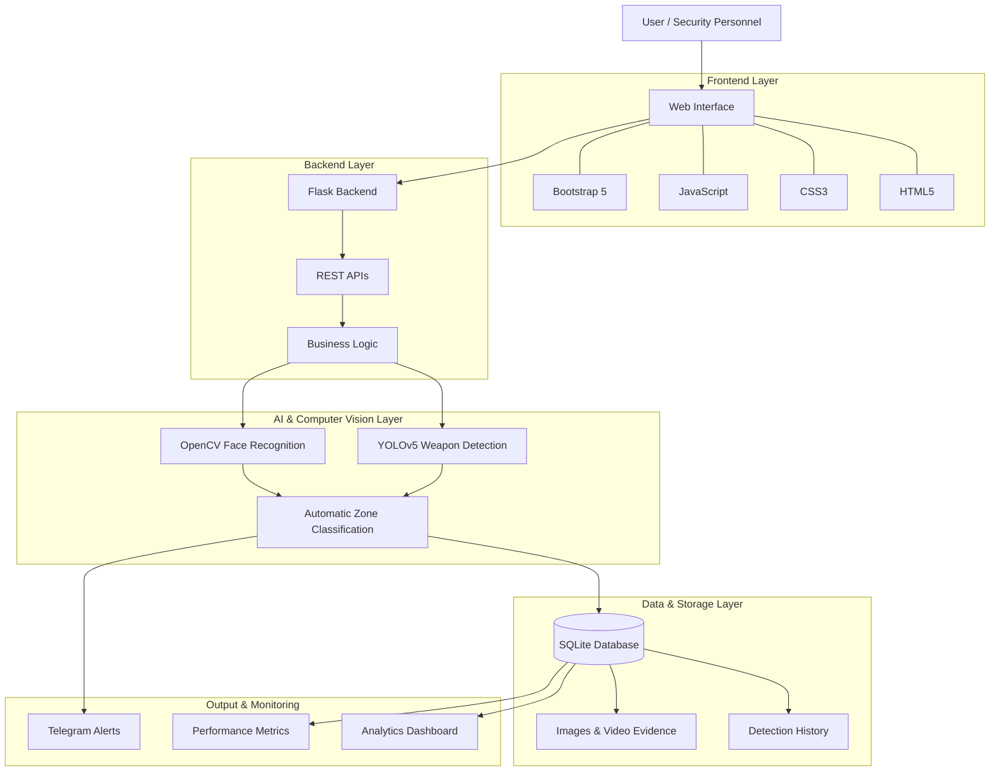

# 🔫 Weapon Detection System

A **Real-Time AI-Powered Weapon Detection System** designed to enhance security and safety through live camera monitoring and image analysis.

The application provides a unified platform for detecting weapons such as **Guns, Knives, Explosions, and Grenades**, with automatic zone classification, Telegram alerts, face recognition, video evidence, and comprehensive analytics.

---

## 📌 Project Overview

Weapon Detection System combines **Artificial Intelligence, Computer Vision, and Full-Stack Web Development** to provide a smart and efficient security monitoring platform.

The main objective is to reduce manual surveillance, organize detection data, improve threat response time, simplify security monitoring, and provide an easy-to-use interface for security personnel, administrators, and law enforcement.

---

## 🚀 Key Features

### 🤖 AI-Powered Detection

* Real-time weapon detection using YOLOv5
* Multi-class detection: Gun, Knife, Explosion, Grenade
* Image upload detection
* Confidence scores for each detection
* Bounding boxes with class labels

### 🚦 Automatic Zone Classification

* 🔴 **RED ZONE:** Gun, Explosion, Grenade (High Alert)
* 🟢 **GREEN ZONE:** Knife (Low Alert)
* ⚪ **CLEAR ZONE:** No weapon detected
* Visual indicator lights on camera view
* Automatic color-coded detection boxes

### 📲 Telegram Alerts

* Real-time notifications with annotated images
* Zone-based priority alerts
* Weapon count, confidence score, and timestamp
* Face recognition results (if a known face is detected)

### 👤 Face Detection & Recognition

* Face detection using OpenCV YuNet
* Face recognition using OpenCV SFace
* Known persons database (`known_faces/` folder)
* Name displayed on detection and Telegram alert

### 📋 Detection History

* Complete record of all detections
* Original and annotated images
* Video evidence (10-second clips)
* Source tracking (Live Camera / Upload)
* Delete individual records

### 🎥 Video Evidence

* Automatic recording: 5 seconds before + 5 seconds after detection
* 10-second evidence clips
* Playable in browser
* Download option

### 📊 Analytics Dashboard

* Total detections (daily, weekly, monthly)
* Weapon type distribution (pie chart)
* Zone-wise detection counts
* Hourly detection trends
* 30-day detection timeline

### ⚡ Performance Metrics

* Real-time FPS counter
* Inference time (ms/frame)
* Model evaluation (Precision, Recall, F1-Score)
* Confusion Matrix visualization
* mAP@0.5 and mAP@0.5:0.95

### 🔐 User Management

* Secure authentication
* Session management
* HTTPS support for mobile camera access

---

## 🛠️ Technology Stack

| Category        | Technologies                         |
| --------------- | ------------------------------------ |
| Frontend        | HTML5, CSS3, JavaScript, Bootstrap 5 |
| Backend         | Python 3.10+, Flask, REST APIs       |
| ORM             | SQLAlchemy                           |
| AI Model        | YOLOv5 (Ultralytics)                 |
| Computer Vision | OpenCV YuNet + SFace                 |
| Database        | SQLite                               |
| Data Processing | NumPy                                |
| Charts          | Chart.js                             |
| Tools           | Git, GitHub, VS Code, PowerShell     |

---

## 🏗️ System Architecture



---

## 📁 Project Structure

```text
Weapon-Detection-System/
│
├── app.py
├── main.py
├── detection.py
├── face_recognition_module.py
├── alerts.py
├── models.py
├── database.py
├── video_evidence.py
├── utils.py
├── evaluate.py
├── convert_dataset.py
│
├── best.pt
├── evaluation_results.json
│
├── .env
├── .gitignore
├── pyproject.toml
├── ALERTS.md
├── README.md
│
├── dataset_yolo/
│   ├── data.yaml
│   ├── images/
│   └── labels/
│
├── known_faces/
│
├── static/
│   ├── css/
│   │   └── styles.css
│   │
│   ├── js/
│   │   └── detection.js
│   │
│   ├── uploads/
│   │
│   ├── results/
│   │   └── videos/
│   │
│   └── evaluation/
│
├── templates/
│   ├── layout.html
│   ├── index.html
│   ├── history.html
│   ├── analytics.html
│   └── evaluation.html
│
└── evaluation_runs/
```

### Project Structure Flowchart

```mermaid
flowchart TD
    A["Weapon Detection System"]

    A --> B["Core Python Files"]
    A --> C["AI Models"]
    A --> D["Dataset"]
    A --> E["Frontend"]
    A --> F["Storage"]
    A --> G["Evaluation"]
    A --> H["Configuration"]

    B --> B1["app.py"]
    B --> B2["main.py"]
    B --> B3["detection.py"]
    B --> B4["face_recognition_module.py"]
    B --> B5["alerts.py"]
    B --> B6["video_evidence.py"]
    B --> B7["models.py"]
    B --> B8["database.py"]
    B --> B9["utils.py"]

    C --> C1["best.pt - YOLOv5"]
    C --> C2["OpenCV YuNet"]
    C --> C3["OpenCV SFace"]

    D --> D1["dataset_yolo/"]
    D1 --> D2["images/"]
    D1 --> D3["labels/"]
    D1 --> D4["data.yaml"]

    E --> E1["static/"]
    E --> E2["templates/"]
    E1 --> E3["css/"]
    E1 --> E4["js/"]
    E1 --> E5["uploads/"]
    E1 --> E6["results/"]
    E2 --> E7["index.html"]
    E2 --> E8["history.html"]
    E2 --> E9["analytics.html"]
    E2 --> E10["evaluation.html"]

    F --> F1["SQLite Database"]
    F --> F2["known_faces/"]

    G --> G1["evaluate.py"]
    G --> G2["convert_dataset.py"]
    G --> G3["evaluation_results.json"]
    G --> G4["evaluation_runs/"]

    H --> H1[".env"]
    H --> H2[".gitignore"]
    H --> H3["pyproject.toml"]
    H --> H4["README.md"]
```



---

## ⚙️ Installation

### 1. Clone the Repository

```bash
git clone https://github.com/YOUR-GITHUB-USERNAME/YOUR-REPOSITORY.git
```

### 2. Open Project Folder

```bash
cd Weapon-Detection-System
```

### 3. Create Virtual Environment

```bash
python -m venv .venv
```

### 4. Activate Virtual Environment

Windows:

```bash
.venv\Scripts\activate
```

### 5. Install Required Packages

```bash
pip install -r requirements.txt
```

Alternatively, install manually:

```bash
pip install flask opencv-python opencv-contrib-python ultralytics
pip install numpy sqlalchemy python-dotenv requests huggingface_hub
```

### 6. Run the Application

```bash
python app.py
```

Open the local URL displayed in your terminal.

---

## 👤 Known Faces Setup

Add known persons' photographs inside the `known_faces/` folder.

```text
known_faces/
└── Aditya_Prasad.jpg
```

---

## 🖥️ Usage

### Live Camera Detection

1. Open the Home page.
2. Click the **Start Scan** button.
3. Allow camera permission.
4. Show an object in front of the camera.
5. The system automatically detects and classifies the result.
6. Zone indicator is displayed.
7. Telegram alert is sent when applicable.
8. Detection is saved in history.

### Image Upload Detection

1. Open the Home page.
2. Navigate to **Select Image for Analysis**.
3. Choose an image (JPG/PNG, max 16MB).
4. Click **Upload & Analyze**.
5. View detection results with bounding boxes.

### View History

* Click **History** in the navigation bar.
* View all recorded detections.

### Analytics Dashboard

* Click **Analytics**.
* View detection charts and statistics.

### Model Evaluation

* Open **Evaluation**.
* Click **Run Evaluation**.
* View performance metrics.

---

## 🧠 Model Details

### Weapon Detection Model

| Parameter            | Value                                      |
| -------------------- | ------------------------------------------ |
| Architecture         | YOLOv5 (Ultralytics)                       |
| Classes              | Gun, Knife, Explosion, Grenade, Background |
| Input Size           | 640 × 640                                  |
| Confidence Threshold | 0.65                                       |
| Model File           | best.pt                                    |

### Face Recognition Model

| Parameter       | Value        |
| --------------- | ------------ |
| Face Detector   | OpenCV YuNet |
| Face Recognizer | OpenCV SFace |
| Embedding Size  | 128-D        |
| Match Threshold | 0.6          |

---

## 📈 Performance Metrics

### Real-Time Performance

| Metric                  | Value                  |
| ----------------------- | ---------------------- |
| Inference Time          | ~84–240 ms/frame (CPU) |
| Practical FPS           | 0.8–2.2 FPS            |
| Face Detection Overhead | +20 ms/frame           |

### Model Evaluation

| Metric      | Value |
| ----------- | ----- |
| Test Images | 472   |
| Precision   | 35.7% |
| Recall      | 1.8%  |
| F1-Score    | 3.5%  |
| mAP@0.5     | 0.3%  |

### Publisher Metrics (YOLOv5)

| Metric    | Value |
| --------- | ----- |
| Precision | 81.5% |
| Recall    | 83.0% |
| F1-Score  | 82.2% |
| mAP@0.5   | 81.1% |

*Note: Publisher metrics are reference figures and are separate from this project's reported evaluation results.*

---

## 🎯 Project Objectives

* Detect weapons in real-time from live camera.
* Classify weapons into danger zones automatically.
* Send instant alerts via Telegram.
* Recognize known persons using face recognition.
* Maintain detection history with video evidence.
* Provide analytics dashboard for monitoring.
* Evaluate model performance with metrics.
* Reduce manual surveillance efforts.
* Improve threat response time.
* Centralize security-related information.

---

## 📚 Learning Outcomes

Working on this project helped me gain practical experience in:

* Python Programming
* Flask Framework
* REST API Development
* Computer Vision (OpenCV)
* YOLOv5 Object Detection
* Face Detection & Recognition
* SQLite Database & SQLAlchemy ORM
* Database Design
* CRUD Operations
* Frontend Development (HTML/CSS/JavaScript)
* Backend Development
* AI Integration
* Git & GitHub
* Software Architecture
* Debugging and Problem Solving

---

## 🔮 Future Improvements

* Advanced weapon type classification (Pistol vs Rifle vs Shotgun)
* Blade classification (Knife vs Sword vs Machete)
* Cloud deployment (AWS/GCP/Azure)
* Mobile application (React Native / Flutter)
* Multi-camera support
* Email/SMS alerts
* PDF report generator
* Edge deployment (Raspberry Pi / Jetson Nano)
* Custom model training
* Privacy mode (face blurring)

---

## 👨‍💻 Developer

**Aditya Prasad**

Python Developer | Full-Stack Developer | AI Enthusiast

* **Course:** BTech CSE (AIML)
* **Semester:** 6th / 3rd Year
* **University:** Jaipur National University
* **Project Guide:** Gaurav Sir

### Technologies

Python • Flask • YOLOv5 • OpenCV • SQLite • SQLAlchemy • JavaScript • HTML • CSS • Bootstrap • Chart.js • Git • GitHub • AI

---

## 🤝 Contributing

If you find this project useful or interesting, feel free to fork the repository.

## 📄 License

This project is developed for educational, learning, and portfolio purposes.

---


  Made with ❤️ by Aditya Prasad
